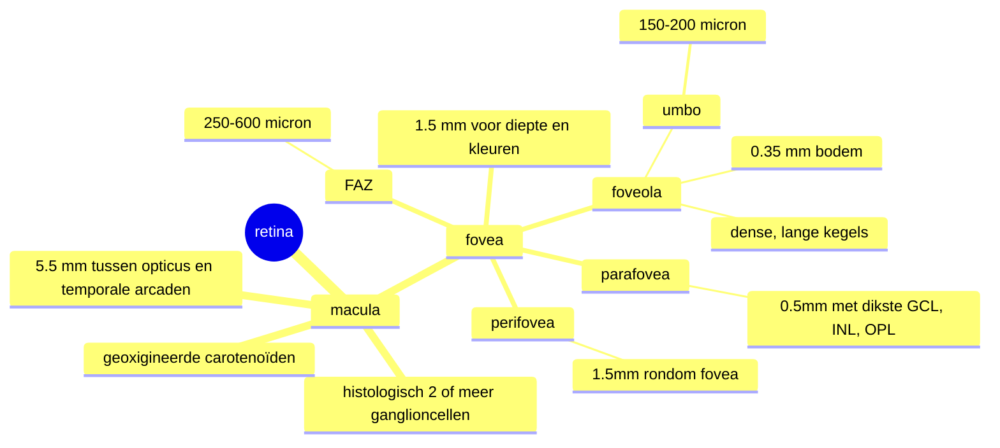

## Glasvocht
centraal en perifeer deel.
structuur: door [[collageen]] fibrillen.
volume: gehydrateerd [[hyaluronzuur]] 2% -> houdt resterende water (98%) vast.

Anterior deel glasvocht: 
[[Wieger ligament]]: collageenfibrillen condenseren op achterkapsel lens (WIEGen de lens).
[[Berger ruimte]]: *potentiële* ruimte tussen anterieure glasvocht en Wieger ligament (opBERGEN).
[[fossa patellaris]]: indeuking van de anterieure glasvocht achter de lens.
![[Pasted image 20250125085525.png]]

Glasvocht basis:
- ringvormig gebeid van dense collageenvezels.
- 2mm vóór en 3-4mm na ora serrata.

Glasvocht verder bevestigd aan:
- lenskapsel, retinale vaten, nervus opticus, fovea.

Op de retinale oppervlakte bindt glasvocht aan [[internal limiting membrane]] met [[fibronectine]] en [[laminine]]. 

De [[premaculaire bursa]]: vermindert mogelijke de tractiekrachten op de macula, soort airbag.

Het [[gebied van Martegiani]] is de opening of leegte die in het glasvocht ontstaat doordat op de papil een soort tentvormige adhesie zit. 
## Neurosensorische retina

### Anatomische en histologische definities
- macula: 5.5mm, tussen papil en temporale vaatbogen
	- histologische definitie: 2 of meer lagen ganglioncellen
	- gele kleur: geoxigineerde carotenoïden ([[luteïne]] en [[zeaxanthine]])
- parafovea: 0.5mm ring 
	- dikste [[ganglion cell layer]], [[inner nuclear layer]] en [[Outer plexiform layer]] 
- fovea: dal inner retina: 1.5mm centrale deel macula
	- wel nog alle lagen, maar alleen kegeltjes
	- hierbinnen 250-600 micron [[foveal avascular zone]] 
- foveola: 0.35mm bodem fovea: kegels zeer dens opeen
	- alleen kegeltjes en Müller uitsteeksels.
- umbo: 150-200 micron kleine inkeping in foveola
![[Pasted image 20250318175617.png]]

Kegeltjes verdeling: neemt snel af naar perifeer, toch is 90% van kegels alsnog perifeer!
![[Pasted image 20250318180032.png]]

Staafjes verdeling: 4mm van centrum fovea het dichste volgens AAO, maar zie ik niet op de Heidelberg plaatjes?
![[Pasted image 20250318180145.png]]

### Retinale lagen
![[Pasted image 20250324175052.png]]

![[Pasted image 20250325090126.png]]
### Fotoreceptoren 
Grofweg onderverdelen in 4 zones:
1. Buitenste (outer) segment: *transductie zone*: licht omzetten naar elektriciteit
	-  [[vitamine A]] afgeleide lichtsensitieve moleculen in 'disk membranen'
	- deze disks worden continu vernieuwd, omdat ze slijten door metabolisme -> fagocytose en afvoeren door RPE.
2. Binnenste (inner) segment: *cellulaire homeostase behouden* (veel mitochondriën)
	- ellipsoïd: bevat mitochondriën
	- myoïd: bevat endoplasmatisch reticulum
	- Kegels hebben veel meer mitochondriën!
3. Nucleair segment: [[outer nuclear layer]] (nucleus hieronder)
4. Transmissie segment: [[Outer plexiform layer]] (inner fiber hieronder samen met bipolaire neuronen)
![[Pasted image 20250319174147.png|500]]

![[Pasted image 20250318180824.png|500]]
### Bipolaire cellen
Eerste neuron van de visuele pathway
Schakelen met ganglioncellen (2e neuron) in de [[inner plexiform layer]]
Kegeltjes schakelen 1-op-1 met 'midget' bipolaire cellen (dure connectie!)
Staafjes kunnen wel meer dan 100-op-1 schakelen

### Ganglioncellen
Verzamelen de input van bipolaire cellen en amacriene cellen.
Genereren actiepotentialen, deze gaan naar de [[nucleus geniculatum laterale]] in de thalamus (3e neuron in visuele pathway).

### Amacriene cellen
Ondersteunen signaalverwerking bij veranderingen (bijvoorbeeld lichtverandering).

### Gliacellen (ondersteunende cellen)
Al die neuronale weefsels moeten ondersteund worden: [[Müller cellen]] 
Houdt alle neuronen bij elkaar

> [!NOTE] Neuronen in de retina banen zich een weg tussen Müller cellen door
> Daar waar de Müller cellen nog continue aansluiten: [[outer limiting membrane]] en [[inner limiting membrane]] 

### Retinale bloedvoorziening
vanuit de [[arteria centralis retinae]]
1. rondom opticus: radial peripapillairy capillary network
2. oppervlakkige vasculaire plexus
3. 2x diepe capillaire complex: aan beide zijdes van INL

> [!NOTE] Vanaf OPL bloedvoorziening door choroïd
> De exacte grens tussen retinale vasculaire voorziening en choroïdale diffusie hangt af van: locatie in de retina, retinale dikte, hoeveelheid licht.

![[Pasted image 20250325100029.png]]

# RPE
