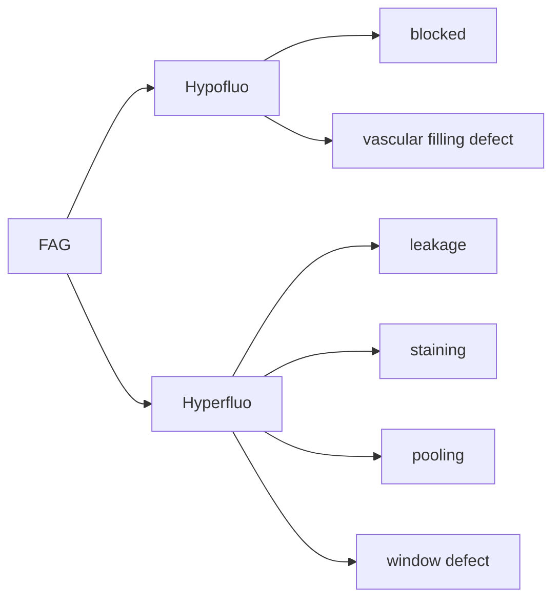

Hoe hoger dioptrie de lens, hoe breder het gezichtsveld, maar hoe kleiner de vergroting.
Vergroting = -60 / [[Dioptrie|dioptrie]] lens.

3-spiegel:
- centraal deel: 20 graden
- elk van de spiegels
- voordeel
	- geen refractie cornea
	- geen astigmatisme cornea

#### OCTA 
als je voldoende snel scans maakt achter elkaar: enige wat beweegt is bloed door de retina
flow visualiseren.
Voordelen:
- tov FAG: is dat je alle lagen van bloedvaten kunt scannen (niet alleen de oppervlakkige plexus)
- non-invasief
- sneller
- Zeer hoge resolutie

Nadeel: 
- je kunt geen lekkage aantonen.
- gevoelig voor bewegingsartefacten
	- er kan ergens bloed lijken te zijn waar dat niet is door beweging
- projectie artefacten: overliggende structuur reflecteert op diepere lagen: je krijgt dan 2x dezelfde structuur.

#### [[autofluorescentie]]
fluoroforen in de retina afbeelden
- [[lipofusceïne]]
- [[melanine]]
- bisretinoïden

wanneer RPE cellen doodgaan: lekt inhoud weg: dus hyPOautoflu 
autoflu dus met name handig bij [[Age-related macular degeneration|leeftijdsgebonden maculadegeneratie]] en [[Uveïtis posterior]] laesies (bijvoorbeeld hyPERautoflu bij de randen)

fluoroforen kunnen ook stapelen in de subretinale ruimte, dit gebeurt bij [[Centraal sereuze chorioretinopathie|CSCR]]: dan zie je hyPERautoflu en een (sereuze) ablatio tussen RPE en fotoreceptoren (hierdoor kunnen fotoreceptoren niet onderhouden of gefagocyteerd worden). Een ander voorbeeld is [[Best vitelloform maculaire dystrofie]] 

#### near infrared autofluo
melanine of lipofusceïne exciteren 

#### Advanced optics
Sferische abberantie van bijvoorbeeld traanfilm wegnemen.
Hierdoor tot groot detail afbeelden van de retina mogelijk: individuele RPE cellen en fotoreceptoren.
Nadeel is:
- sterk afhankelijk van heldere media
- tijdrovend
- duur en nog niet praktisch voor klinische praktijk

#### fluorescentie angiografie

fluorescentie is wanneer stof door bepaalde golflengte wordt beschenen, en een andere golflengte licht afgeeft.
Excitatie: blauw-groen licht (465-490 nm) [[lichtspectrum]] uitzenden (toppunt van fluorescine).
Fluorescentie: filter geel (520-530 nm) licht afgegeven door ge-exciteerd fluorescine.
80% van ingespoten fluorescine wordt gebonden aan plasma-eiwitten.
Lekkage is het essentiele diagnosticum:
In oppervlakkige capillaire plexus:
- neo's
- ontbreken bloed-retina barriere
- defecten bloed retina barriere
	- ischemie
	- ontsteking

In de choriocappillaris lekt fluo makkelijk weg en geeft dus diffuse staining. Ook absorbeert het RPE en choroïd licht -> hierdoor kun je niet goed flu gebruiken om choroïd(capillaris) te beoordelen.

Fases:
- choroïdale fase: na 8-12 seconden
- arteriële fase: na 11-18 seconden
- arterioveneuze fase: 1-3 seconden daarna
	- complete arteriële vulling
	- laminar flow in grote venen
		- als choroïd dan nog niet gevuld is: abnormaal
- veneuze fase: 5-10 seconden daarna (complete veneuze vulling)
- recirculatie fase: 2-4 minuten later
- late fase: 4-5 minuten later: geleidelijke eliminatie kleurstof uit retina en choroïd.

Fovea is donkerder op FAG omdat:
- er geen vaten lopen
- RPE cellen hoger zijn 
- RPE cellen meer melanine bevatten

HyPOfluorescentie:
- geblokkeerde vulling:
	- weefsel in de weg
		- fibreus
		- bloed
		- pigment
- retinale vaten vullen niet of gedeeltelijk

HyPERfluorescentie
- **lekkage**: geleidelijke toename: fluo sijpelt langs bloed-retina barriere
	- buitenste bloed-retina barriere: fluo sijpelt langs RPE in subretinale ruimte of neuroretina
	- binnenste bloed-retina barriere: fluo sijpelt in parenchym, fibrose, of cystes
		- als de [[external limiting membrane]] gecompromitteerd is: ook mogelijk vanuit posterior naar parenchym
- **staining**: randen worden helderder maar blijven intact 
	- fluo trekt weefsels in: neemt toe in de loop van frames
	- litteken, drusen, bloedvaten, opticus weefsel, sclera
- **pooling**: fluo loopt ruimte met vocht in en blijft daarin gevangen, bijvoorbeeld sereuze ablatio bij [[Centraal sereuze chorioretinopathie|CSCR]] 
- **window of transmissie defect** RPE is defect, daar doorheen zie je normale choroïdale fluo
	- dus vroege fluo, die maximaal is met vulling van het choroïd, en daarna afneemt
	- verandert niet in grootte of vorm.

![[Pasted image 20250521203425.png]]

##### bijwerkingen FAG
5% misselijk
5% huidafwijkingen (urticaria)

1:222,000 hypotensie, shock, larynxspasme, overlijden

#### ICG
wateroplosbaar.
98% bindt aan eiwitten in plasma -> diffundeert dus nauwelijks door choriocapillaris.
Hierdoor kun je er goed choroïdale vaten mee beoordelen.
Near infrared: excitatie 790-805 nm en emissie 825-835 nm [[lichtspectrum]]
Fases:
- vroeg choroïdaal: vulling vaten.
- middel (5-15 minuten): vaten minder duidelijk, meer diffuse kleuring
- late fase (na 15 minuten): minder details

ICGA met name belangrijk bij:
- [[Polypoïdale choroïdale vasculopathie|PCV]]
- [[Retinal angiomatous proliferation|RAP]]
- inflammatoire ziekten
	- [[Birdshot retinochoroïditis]]
- werd voorheen meer gebruikt bij [[Centraal sereuze chorioretinopathie|CSCR]], maar nu vaker met FAG en OCT.

#### bijwerkingen ICG
1% heeft milde bijwerkingen.
jodiumallergie is relatieve contra-indicatie.
wordt in de lever geklaard via gal, dus leverproblemen -> langer in bloed. 
